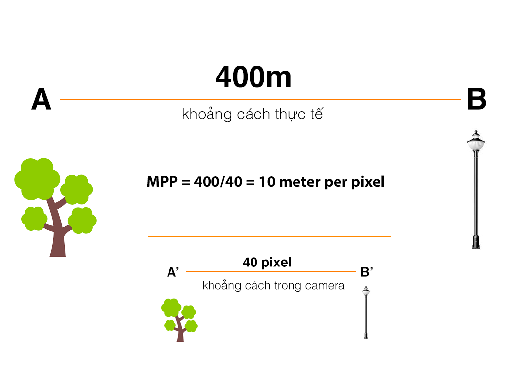

# Object Tracking
## Library: OpenCV
Trong OpenCV có đến 8 phương pháp OT khác nhau (đó là OOSTING Tracker, MIL Tracker, KCF TRacker, MedianFlow Tracker, TLD Tracker, MOSSE Tracker, GOTURN Tracker). Trong đó thông dụng nhất sẽ là:
- MOSSE TRacker: Tốc độ cao nhất, chính xác thấp nhất. Sử dụng trong các bài toán cần ưu tiên tốc độ.
- KCF Tracker: Tốc độ chậm hơn MOSSE và chính xác cao hơn MOSSE
- CSRT Tracker: Tốc độ chậm nhất trng 3 món nhưng độ chính xác lại cao nhất.
## Vehicle speed measurement using Object Detection and Object Tracking
### Step1: Chúng ta tiến hành detect các xe hợi trong ảnh và thực hiện gán nhãn và tracking các xe đó.
### Step2: Chúng ta xác định tọa dộ của các xe (đã được tracking) giữa 02 frame gọi là P1 và P2
### Step3: Dựa vào TD1 và TD2 chúng ta tính ra được khoảng cách di chuyển gọi là S theo pixel bằng công thức KC = |TD1 - TD2|.
### Step4: Chúng ta tính khoảng cách ước lượng theo mét -KCM- phụ thuộc theo tham số  "Số mét tương ứng với 1 pixel"-MPP. Vậy KCM = KC*MPP
### Step5: Tính tốc độ bằng m/s bằng công thức TDs=KCM*FPS (số frame xử lý trong 1 giây)sau đó quy đổi sang km/h.
**Giải thích:**
- Gọi số giât xử lý được 1 Frame và tính được KCM là  t(giây)
- Suy ra số Frame xử lý trong 1 giây là FPS=1/t
- KCM là trong t giây -> khoảng cách đi được trong 1 giây sẽ là KCM/t hay TDs = KCM*FPS
=> Thuật toán muốn chính xác cao phải xác định tham số PPM cho chính xác. Dựa vào đo đạc thực tế và dựa vào hình ảnh trên video để xác định bao nhiêu pixel trên ảnh thì ứng với 1 mét ngoài đời thực.
### How to find PPM
- Chọn 2 điểm A và B cố định dùng để tính tốc độ, ví dụ cái cây trong ảnh và môjt cái cột trong ảnh. Sau đó đo thực tế là 400 mét.
- Tính toán trong ảnh camera và xác định được pixel là 40pixel
=> MPP = 400/40 =10 m/pixel

  

### How to running
- Install package needed
**pip install -r setup.txt**
- Running
**python3 speed_estimate.py**
